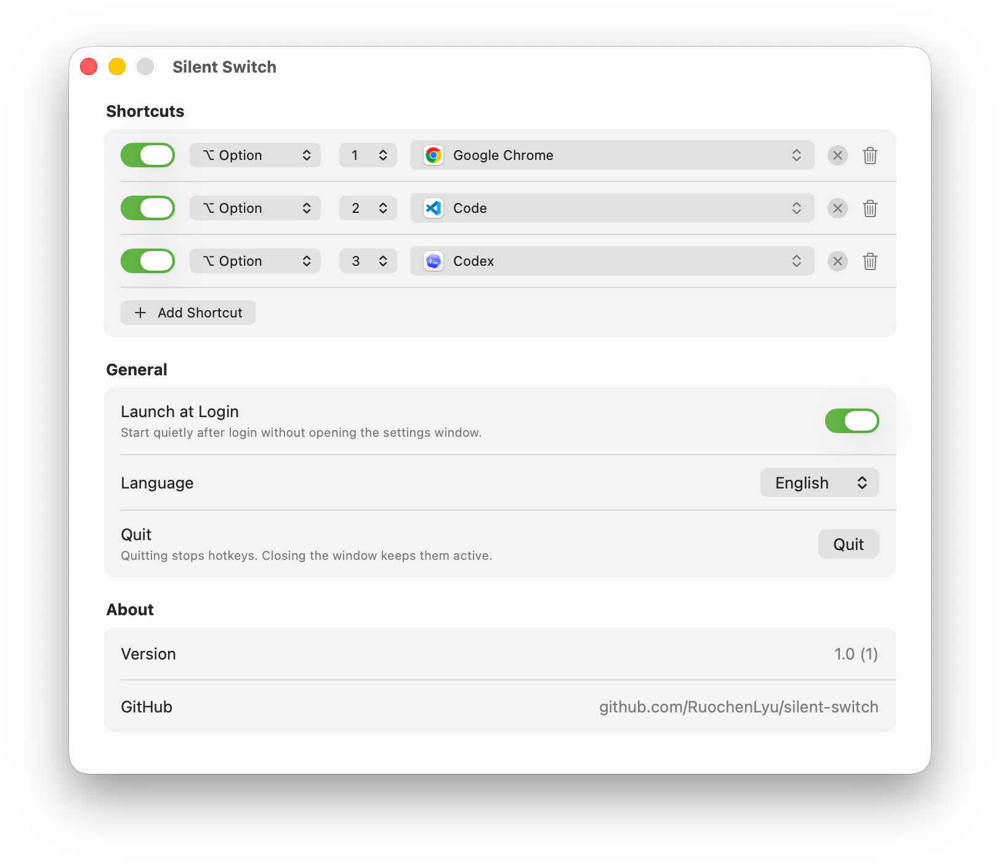

# Silent Switch

> Language: English | [中文](README.md)

Silent Switch is a native macOS background utility for launching or switching apps with fixed digit hotkeys.

```text
Option / Command / Control + top-row digit 1...9
```

It has no Dock icon, no menu bar icon, no overlay, no notifications, and no analytics. The only visible surface is the settings window.



## Features

- Supports `Option + 1...9`, `Command + 1...9`, and `Control + 1...9`
- Binds each hotkey to one `.app`
- Activates the target app if it is running, or launches it otherwise
- Swallows matched hotkeys and passes all other keystrokes through unchanged
- Supports silent launch at login
- Supports Chinese and English UI

## Install And Use

Download the DMG from [Releases](https://github.com/RuochenLyu/silent-switch/releases), then drag `Silent Switch.app` into `Applications`. The settings window appears on first launch.

1. Click `Grant Permission` and allow Accessibility access in System Settings.
2. Choose a target app for each hotkey.
3. Close the settings window to keep using the app in the background.
4. Click `Quit` in the settings window when you want to stop listening.

Config is stored at:

```text
~/Library/Application Support/com.aix4u.silentswitch/config.json
```

### About Release Builds

Release packages are not signed with a Developer ID and are not notarized by Apple. macOS may warn that it cannot verify the developer on first launch; this is expected.

Only install the package if you trust the source code and the release source. If macOS blocks the app, follow Apple's official instructions and choose `Open Anyway` in `System Settings -> Privacy & Security -> Security`. The more conservative option is to build from source.

Reference: [Open a Mac app from an unknown developer - Apple Support](https://support.apple.com/en-nz/guide/mac-help/-mh40616/mac)

## Hotkey Rules

- Only top-row digits `1...9` are supported. Numpad digits are not supported.
- Only one modifier is supported: `Option`, `Command`, or `Control`.
- Multi-modifier combinations such as `Shift + Option + 1` are not supported.
- `Caps Lock` does not affect matching.
- Disabled, duplicate, or target-less hotkeys do not take effect.

## Troubleshooting

### Hotkeys do not work

First check that the settings window is not showing a permission warning, and that the hotkey is enabled with a target app selected.

If hotkeys still do not work after replacing the app or rebuilding locally, reset Accessibility permission and grant it again:

```sh
tccutil reset Accessibility com.aix4u.silentswitch
```

Accessibility permission is tied to the app's code signing identity. After local signing, rebuilding, or replacing the app, an old-looking grant in System Settings may no longer apply to the current binary.

### Why Accessibility permission is required

Silent Switch uses `CGEventTap` to capture key events. It only swallows a key event when the hotkey fully matches; all other key events pass through unchanged.

## Development

Requires macOS 15+ and an Xcode version that supports Swift 6.

```sh
make test          # run unit tests
make run           # build and open the Debug app
make build-debug   # build the Debug app
make build         # build the Release app
make package       # build the Release app and produce DMG/ZIP
make clean         # remove build/
```

Output locations:

```text
build/Debug/Silent Switch.app
build/Release/Silent Switch.app
dist/SilentSwitch-<version>-macos-<arch>.dmg
dist/SilentSwitch-<version>-macos-<arch>.zip
```

Scripts default to `/Applications/Xcode.app/Contents/Developer`. To override:

```sh
DEVELOPER_DIR=/path/to/Xcode.app/Contents/Developer make test
```

Build scripts prefer an existing Apple Development identity, or a local identity named `Silent Switch Local Development`. To explicitly create a local self-signed identity:

```sh
SILENT_SWITCH_CREATE_SELF_SIGNED_IDENTITY=1 make setup-signing
```

## Project Layout

```text
SilentSwitch/App/                 App lifecycle and dependency wiring
SilentSwitch/Window/              Settings window shell
SilentSwitch/Domain/              Config model, hotkey matching, validation
SilentSwitch/Infrastructure/      macOS system capability wrappers
SilentSwitch/Features/Settings/   Settings window UI
SilentSwitch/Resources/           Info.plist, icons, localized strings
SilentSwitchTests/                Unit tests
scripts/                          Build, test, and run scripts
```

User-facing strings live in `SilentSwitch/Resources/Localizable.xcstrings`. Runtime logs use `OSLog`.

## Non-Goals

Silent Switch v1 does not support window-level switching, multi-modifier combos, menu bar entry, Dock mode, cloud sync, App Store sandboxing, or notarized binaries.

## License

MIT License. See [LICENSE](LICENSE).
