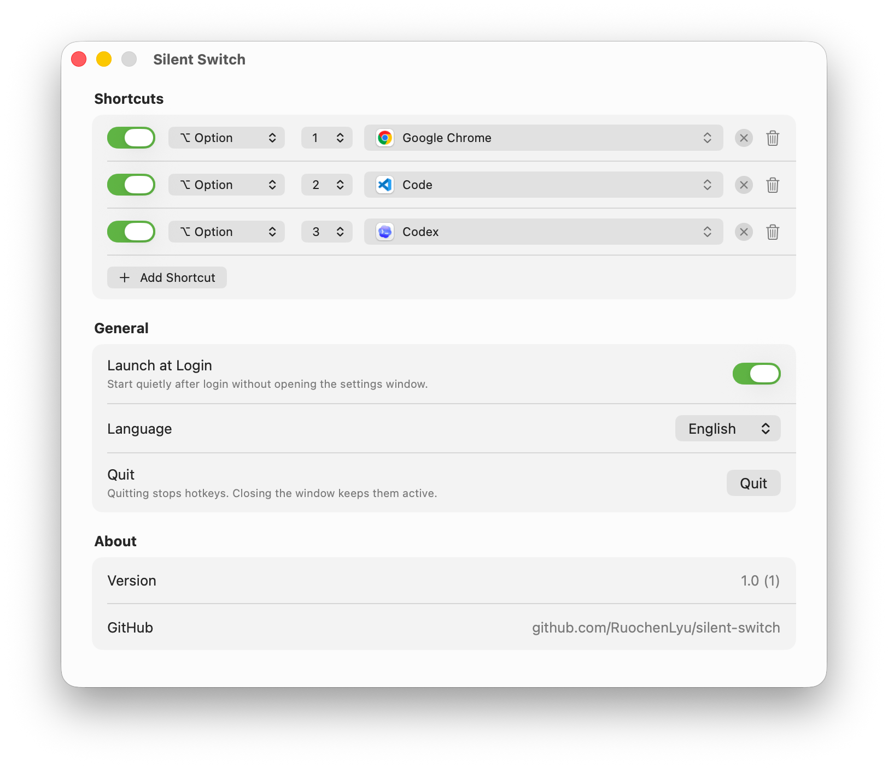

# Silent Switch

> Language: English | [中文](README.md)

Silent Switch is a lightweight macOS app switcher. Assign frequently used apps to digit shortcuts and switch with one keystroke; apps launch automatically when they are not already running.

```text
Option / Command / Control + top-row digit 1...9
```

It stays quietly in the background with no Dock icon, menu bar icon, overlay, or notifications, and it collects no usage data. The settings window is its only visible surface.



## Features

- Supports `Option + 1...9`, `Command + 1...9`, and `Control + 1...9`
- Binds each shortcut to one frequently used app
- Switches immediately when the app is running, or launches it otherwise
- Registers only configured combinations and leaves all other keyboard input untouched
- Supports silent launch at login
- Supports Chinese and English UI

## Install And Use

Download the DMG from [Releases](https://github.com/RuochenLyu/silent-switch/releases), then drag `Silent Switch.app` into `Applications`. Release packages are signed with an Apple Developer ID and notarized by Apple.

Requires macOS 15 or later. Release packages include both Apple Silicon and Intel architectures.

1. Choose a target app for each hotkey.
2. Close the settings window to keep using the app in the background.
3. Click `Quit App` in the settings window when you want to stop using it.

Config is stored at:

```text
~/Library/Application Support/com.aix4u.silentswitch/config.json
```

## Hotkey Rules

- Only top-row digits `1...9` are supported. Numpad digits are not supported.
- Only one modifier is supported: `Option`, `Command`, or `Control`.
- Multi-modifier combinations such as `Shift + Option + 1` are not supported.
- `Caps Lock` does not affect matching.
- Disabled, duplicate, or target-less hotkeys do not take effect.

## Troubleshooting

### Hotkeys do not work

Confirm that the shortcut is enabled with a target app selected, then click `Try Again` beside the shortcut status. If the status still reports a failure, another app or system feature has usually registered that combination. Choose another shortcut or quit the app that owns it.

View diagnostic logs in Terminal with:

```sh
log stream --level debug --style compact \
  --predicate 'subsystem == "com.aix4u.silentswitch"'
```

### Why Accessibility permission is not required

Silent Switch uses macOS's system-level global shortcut support and registers only the combinations you configure. It does not need to read all keyboard input, so no Accessibility permission is required and app-signing changes cannot invalidate an old permission grant.

Hotkeys follow the macOS Carbon event-dispatch lifecycle: combinations are registered before the event handler is installed. This order has been verified on the macOS 26 machine where shortcuts previously failed to fire.

## Development

Requires macOS 15+ and an Xcode version that supports Swift 6.

```sh
make test          # run unit tests
make run           # build and open the Debug app
make build-debug   # build the Debug app
make build         # build the Release app
make package       # build the Release app and produce DMG/ZIP
make verify        # run tests and verify a universal Release build
make package-notarized # build, notarize, and staple the release
make clean         # remove build/
```

Output locations:

```text
build/Debug/Silent Switch.app
build/Release/Silent Switch.app
dist/SilentSwitch-<version>-macos-universal.dmg
dist/SilentSwitch-<version>-macos-universal.zip
```

Scripts default to `/Applications/Xcode.app/Contents/Developer`. To override:

```sh
DEVELOPER_DIR=/path/to/Xcode.app/Contents/Developer make test
```

Build scripts prefer an existing Apple Development identity, or a local identity named `Silent Switch Local Development`. To explicitly create a local self-signed identity:

```sh
SILENT_SWITCH_CREATE_SELF_SIGNED_IDENTITY=1 make setup-signing
```

Run `make verify` before an official release. Releases use `make package-notarized`, which requires a `Developer ID Application` certificate and a `silent-switch-notary` notary profile in Keychain. The command reruns tests, checks the version and universal architectures, performs signing, notarization, and Gatekeeper validation, and writes a SHA-256 checksum file.

## Project Layout

```text
SilentSwitch/App/                 App lifecycle and dependency wiring
SilentSwitch/Window/              Settings window shell
SilentSwitch/Domain/              Config model and shortcut validation
SilentSwitch/Infrastructure/      macOS system capability wrappers
SilentSwitch/Features/Settings/   Settings window UI
SilentSwitch/Resources/           Info.plist, icons, localized strings
SilentSwitchTests/                Unit tests
scripts/                          Build, test, and run scripts
```

User-facing strings live in `SilentSwitch/Resources/Localizable.xcstrings`. Runtime logs use `OSLog`.

## Contributing

Issues and pull requests are welcome. Before submitting code, run `make test` and confirm that a Release build succeeds.

See [CONTRIBUTING.md](CONTRIBUTING.md) for development conventions, [CHANGELOG.md](CHANGELOG.md) for release history, and [SECURITY.md](SECURITY.md) for security reporting.

## Design Boundaries

Silent Switch focuses on quiet, reliable app switching. The current version does not provide window-level switching, multi-modifier combinations, a menu bar entry, Dock mode, or cloud sync.

## License

MIT License. See [LICENSE](LICENSE).
