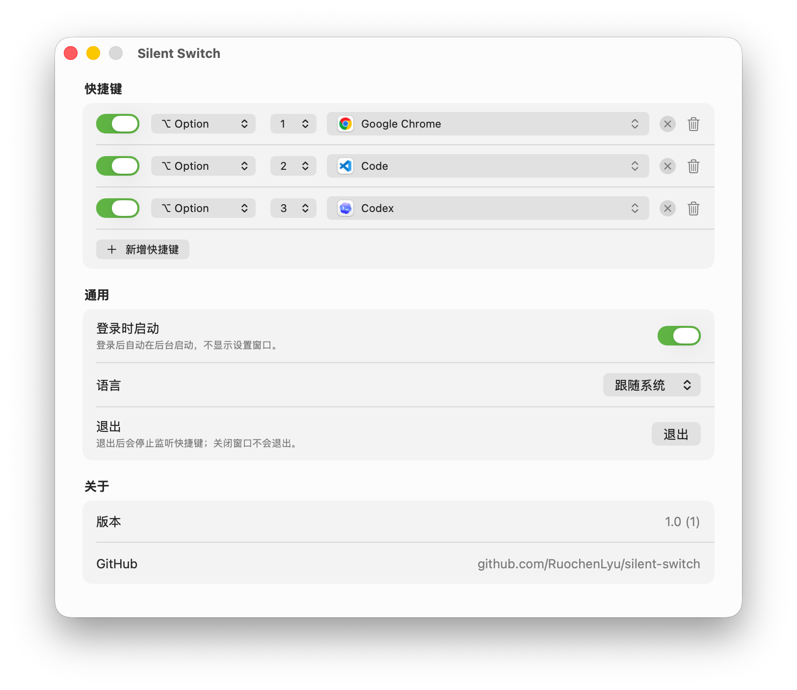

# Silent Switch

> 语言：中文 | [English](README.en.md)

Silent Switch 是一个 macOS 原生后台工具：用固定数字快捷键启动或切换应用。

```text
Option / Command / Control + 顶部数字键 1...9
```

它没有程序坞图标、菜单栏图标、屏幕浮层、通知或统计。唯一可见界面是设置窗口。



## 功能

- 支持 `Option + 1...9`、`Command + 1...9`、`Control + 1...9`
- 每个快捷键绑定一个应用
- 目标已运行时切换到它，未运行时启动它
- 命中的快捷键会被拦截，未命中的按键原样放行
- 支持登录后静默启动
- 支持中文和英文界面

## 安装与使用

从 [Releases](https://github.com/RuochenLyu/silent-switch/releases) 下载安装包后，把 `Silent Switch.app` 拖到“应用程序”。首次打开会显示设置窗口。

1. 点击 `授予权限`，在系统设置里允许辅助功能访问。
2. 为每个快捷键选择目标应用。
3. 关闭设置窗口即可在后台继续使用。
4. 需要停止监听时，在设置窗口点击 `退出`。

配置文件保存在：

```text
~/Library/Application Support/com.aix4u.silentswitch/config.json
```

### 发布包说明

当前发布包没有 Apple 开发者签名，也没有经过 Apple 公证。macOS 首次打开时可能提示“无法验证开发者”，这是预期行为。

请只在信任源码和发布来源时安装。若系统拦截打开，可按 Apple 官方说明，在“系统设置 -> 隐私与安全性 -> 安全性”里选择“仍要打开”；更谨慎的做法是从源码自行构建。

参考：[打开来自未知开发者的 Mac App - Apple 支持](https://support.apple.com/zh-cn/guide/mac-help/open-a-mac-app-from-an-unknown-developer-mh40616/mac)

## 快捷键规则

- 只支持顶部数字键 `1...9`，不支持小键盘数字键。
- 只支持单个修饰键：`Option`、`Command` 或 `Control`。
- 不支持多修饰键组合，例如 `Shift + Option + 1`。
- `Caps Lock` 不影响匹配。
- 未设置目标应用、被禁用或重复的快捷键不会生效。

## 常见问题

### 快捷键不生效

先确认设置窗口里没有权限提示，并且对应快捷键已启用、已选择应用。

如果覆盖安装或本地重建后仍不生效，重置辅助功能授权后重新授予：

```sh
tccutil reset Accessibility com.aix4u.silentswitch
```

辅助功能权限和应用的代码签名身份绑定。自签名、本地构建、覆盖安装后，系统设置里看起来存在的旧授权可能不再适用于当前可执行文件。

### 为什么需要辅助功能权限

Silent Switch 使用 `CGEventTap` 捕获按键事件。它只在快捷键完全匹配时拦截该按键；其他按键会原样放行。

## 开发

需要 macOS 15+ 和支持 Swift 6 的 Xcode。

```sh
make test          # 跑单元测试
make run           # 构建并打开调试版本
make build-debug   # 构建调试版本
make build         # 构建发布版本
make package       # 构建发布版本并生成安装包
make clean         # 删除 build/
```

输出位置：

```text
build/Debug/Silent Switch.app
build/Release/Silent Switch.app
dist/SilentSwitch-<version>-macos-<arch>.dmg
dist/SilentSwitch-<version>-macos-<arch>.zip
```

脚本默认使用 `/Applications/Xcode.app/Contents/Developer`。如需覆盖：

```sh
DEVELOPER_DIR=/path/to/Xcode.app/Contents/Developer make test
```

构建脚本会优先复用本机已有的 Apple Development 签名身份，或名为 `Silent Switch Local Development` 的本地签名身份。确需创建本地自签名身份时：

```sh
SILENT_SWITCH_CREATE_SELF_SIGNED_IDENTITY=1 make setup-signing
```

## 项目结构

```text
SilentSwitch/App/                 应用生命周期和依赖装配
SilentSwitch/Window/              设置窗口外壳
SilentSwitch/Domain/              配置模型、快捷键匹配和校验
SilentSwitch/Infrastructure/      macOS 系统能力封装
SilentSwitch/Features/Settings/   设置窗口界面
SilentSwitch/Resources/           Info.plist、图标、本地化字符串
SilentSwitchTests/                单元测试
scripts/                          构建、测试、运行脚本
```

用户可见字符串集中在 `SilentSwitch/Resources/Localizable.xcstrings`，运行期日志使用 `OSLog`。

## 不做什么

Silent Switch v1 不做窗口级切换、多修饰键组合、菜单栏入口、程序坞模式、云同步、App Store 沙盒或公证发布包。

## License

MIT License. 见 [LICENSE](LICENSE)。
