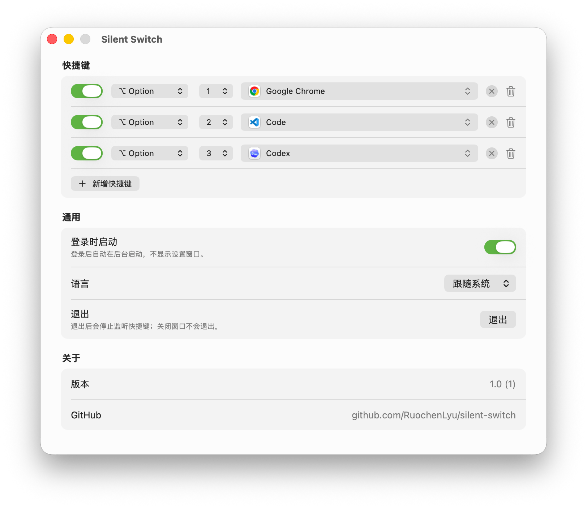

# Silent Switch

> 语言：中文 | [English](README.en.md)

Silent Switch 是一个轻量的 macOS 应用切换工具。把常用应用固定到数字快捷键，一按即可切换；应用尚未运行时会自动启动。

```text
Option / Command / Control + 顶部数字键 1...9
```

它安静地驻留在后台，不显示程序坞图标、菜单栏图标、屏幕浮层或通知，也不收集使用数据。唯一可见界面是设置窗口。



## 功能

- 支持 `Option + 1...9`、`Command + 1...9`、`Control + 1...9`
- 每个快捷键绑定一个常用应用
- 应用已运行时立即切换，尚未运行时自动启动
- 只注册已配置的组合键，不影响其他键盘输入
- 支持登录后静默启动
- 支持中文和英文界面

## 安装与使用

从 [Releases](https://github.com/RuochenLyu/silent-switch/releases) 下载安装包后，把 `Silent Switch.app` 拖到“应用程序”。发布包已使用 Apple Developer ID 签名，并经过 Apple 公证。

支持 macOS 15 及以上版本，同时包含 Apple Silicon 与 Intel 架构。

1. 为每个快捷键选择目标应用。
2. 关闭设置窗口即可在后台继续使用。
3. 需要停止使用时，在设置窗口点击 `退出应用`。

配置文件保存在：

```text
~/Library/Application Support/com.aix4u.silentswitch/config.json
```

## 快捷键规则

- 只支持顶部数字键 `1...9`，不支持小键盘数字键。
- 只支持单个修饰键：`Option`、`Command` 或 `Control`。
- 不支持多修饰键组合，例如 `Shift + Option + 1`。
- `Caps Lock` 不影响匹配。
- 未设置目标应用、被禁用或重复的快捷键不会生效。

## 常见问题

### 快捷键不生效

先确认对应快捷键已启用并已选择应用，然后点击快捷键状态右侧的 `重试`。若状态仍显示失败，通常表示该组合键已经被其他应用或系统功能注册，请更换组合键或退出占用它的应用。

诊断日志可以通过终端查看：

```sh
log stream --level debug --style compact \
  --predicate 'subsystem == "com.aix4u.silentswitch"'
```

### 为什么不需要辅助功能权限

Silent Switch 使用 macOS 的系统级全局快捷键能力，只注册你配置的组合键，不需要读取全部键盘输入。因此安装后无需授予辅助功能权限，也不会受旧授权或应用签名变化影响。

快捷键按 macOS 的 Carbon 事件分发顺序注册：先注册组合键，再安装事件处理器。这个顺序已在此前无法触发快捷键的 macOS 26 设备上实机验证。

## 开发

需要 macOS 15+ 和支持 Swift 6 的 Xcode。

```sh
make test          # 跑单元测试
make run           # 构建并打开调试版本
make build-debug   # 构建调试版本
make build         # 构建发布版本
make package       # 构建发布版本并生成安装包
make verify        # 运行测试并验证通用 Release 构建
make package-notarized # 构建、Apple 公证并贴票
make clean         # 删除 build/
```

输出位置：

```text
build/Debug/Silent Switch.app
build/Release/Silent Switch.app
dist/SilentSwitch-<version>-macos-universal.dmg
dist/SilentSwitch-<version>-macos-universal.zip
```

脚本默认使用 `/Applications/Xcode.app/Contents/Developer`。如需覆盖：

```sh
DEVELOPER_DIR=/path/to/Xcode.app/Contents/Developer make test
```

构建脚本会优先复用本机已有的 Apple Development 签名身份，或名为 `Silent Switch Local Development` 的本地签名身份。确需创建本地自签名身份时：

```sh
SILENT_SWITCH_CREATE_SELF_SIGNED_IDENTITY=1 make setup-signing
```

正式发布前先运行 `make verify`。发布使用 `make package-notarized`，需要本机 Keychain 里存在 `Developer ID Application` 证书和 `silent-switch-notary` 公证凭据。该命令会再次运行测试，校验版本号与双架构，完成签名、公证和 Gatekeeper 验证，并生成 SHA-256 校验文件。

## 项目结构

```text
SilentSwitch/App/                 应用生命周期和依赖装配
SilentSwitch/Window/              设置窗口外壳
SilentSwitch/Domain/              配置模型和快捷键校验
SilentSwitch/Infrastructure/      macOS 系统能力封装
SilentSwitch/Features/Settings/   设置窗口界面
SilentSwitch/Resources/           Info.plist、图标、本地化字符串
SilentSwitchTests/                单元测试
scripts/                          构建、测试、运行脚本
```

用户可见字符串集中在 `SilentSwitch/Resources/Localizable.xcstrings`，运行期日志使用 `OSLog`。

## 参与贡献

欢迎提交 Issue 或 Pull Request。提交代码前请先运行 `make test`，并确保 Release 构建可以通过。

开发约定和提交检查见 [CONTRIBUTING.md](CONTRIBUTING.md)，版本变化见 [CHANGELOG.md](CHANGELOG.md)，安全问题报告方式见 [SECURITY.md](SECURITY.md)。

## 设计边界

Silent Switch 专注于安静、可靠的应用切换。当前版本不提供窗口级切换、多修饰键组合、菜单栏入口、程序坞模式或云同步。

## License

MIT License. 见 [LICENSE](LICENSE)。
